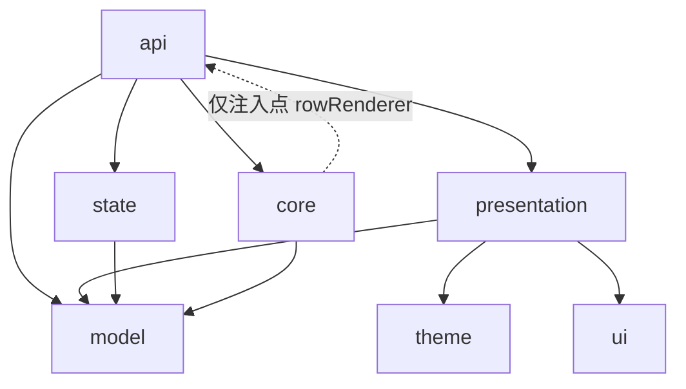
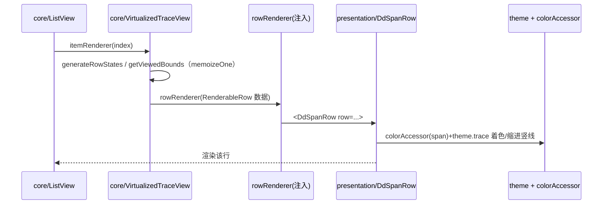

# Architecture Spine — Datadog 风格 Trace Timeline 组件库

## Design Paradigm

**分层（Layered）+ 移植引擎/注入皮肤**。七层，依赖单向向下；引擎与皮肤在 `rowRenderer` 接缝处**依赖反转**。

| 层 | 命名空间 | 职责 | 来源 |
| --- | --- | --- | --- |
| api | `src/api` | 对外 `<TraceTimeline>` + 导出；把皮肤注入引擎 | 新写 |
| presentation | `src/presentation` | Datadog 外观：行/条/标签列/缩进线/表头/详情/工具条 | 新写 FC |
| core | `src/core` | 引擎：虚拟滚动、行状态、时间映射、滚动定位 | 移植 Grafana（Apache）class |
| state | `src/state` | `useTraceTimelineState`（组合 hooks + 受控回退） | 移植+包装 |
| model | `src/model` | `Trace/TraceSpan` 类型、`transformTraceData`、`adapters/` | 移植 Grafana（Apache） |
| theme | `src/theme` | `createTheme`(DRUIDS)、`ThemeProvider`、`useStyles2`、`colorGenerator`(Datadog 色板) | 新写+移植算法 |
| ui | `src/ui` | Icon(lucide)、Tooltip、Menu、Dropdown 原语 | 新写 |

## Invariants & Rules

### AD-1 — 两层：移植引擎 + 注入皮肤
- **Binds:** all（FR-1..FR-28）
- **Prevents:** Datadog 外观差异（缩进竖线/状态 pill/Color-by/圆角）污染引擎；引擎与上游难对照
- **Rule:** 引擎（虚拟滚动/树折叠/数据/时间映射/状态）与 Datadog 表现层（行/条/标签/缩进/详情）物理分离；引擎不含任何外观逻辑。

### AD-2 — 依赖反转于 rowRenderer 接缝；core 零 Datadog/theme/ui import
- **Binds:** core, presentation, api
- **Prevents:** core 引用皮肤导致 Apache 来源不纯、无法换皮
- **Rule:** `core` 只暴露 `rowRenderer(row: RenderableRow): ReactNode` 注入点，自身 import 仅限 `model` 与 React；`api/<TraceTimeline>` 负责把 `presentation` 的行渲染器注入引擎。`RenderableRow` 是**唯一**接缝契约，必须是导出的 TS 接口（字段下全部精确定义，**无颜色、无主题**）：
  - `span: TraceSpan`、`spanIndex: number`、`isDetail: boolean`、`depth: number`
  - `ancestorSpanIds: string[]` — **根→父有序**，不含自身，不变量 `length === depth`（FR-25 缩进竖线逐层对齐）
  - `viewBounds: { start: number; end: number; clippingLeft: boolean; clippingRight: boolean }` — **已投影到当前缩放后的 [0,1] 相对值**（= core `getViewedBounds(span.start, span.end)` 输出）；presentation **禁止**自行做时间映射（违反 AD-1）；`clipping*` 喂 FR-8 裁剪提示
  - `isCollapsed/isMatchingFilter/isFocused: boolean`
  - `isError: boolean`（**本 span** 报错）、`descendantHasError: boolean`（折叠时**子树**含错误）——二者分离，分别驱动 ⚠ 图标与折叠父条提示（FR-15/26）
  - `httpStatus?: number`（驱动状态 pill，FR-26）
  - `rpc?: { serviceName: string; operationName: string; process: TraceProcess; viewStart: number; viewEnd: number }` — RPC 合并的 server 子 span **数据**（`process` 供 presentation 经 colorAccessor 着色，core 不着色，FR-17）
  - `criticalPathSections: CriticalPathSection[]`、`columnWidth: number`
  - 回调：`onChildrenToggle/onDetailToggle/...`

### AD-3 — 引擎核心 class 照搬；新代码 FC+hooks
- **Binds:** core vs (presentation/state/api/theme/ui)
- **Prevents:** 重写虚拟滚动引入生命周期行为偏差
- **Rule:** `VirtualizedTraceView / ListView / Positions` 保留 class + `memoizeOne` + 手写 `shouldComponentUpdate`，逐文件对照上游移植；其余新写代码一律 FC + hooks。

### AD-4 — 状态更新必须不可变
- **Binds:** state, core
- **Prevents:** 引擎 `memoizeOne` 引用相等缓存（`generateRowStates`/`viewedBounds`）失效或漏更新
- **Rule:** `childrenHiddenIDs/detailStates/findMatchesIDs/hoverIndentGuideIds/viewRange` 等一律新建 `Set/Map/数组/对象` 替换，禁止原地 mutate。

### AD-5 — 状态容器组合现成 hook + 受控回退
- **Binds:** state, api（FR-23）
- **Prevents:** 受控/非受控混乱、与上游状态逻辑分叉
- **Rule:** `useTraceTimelineState` 组合移植的 `useChildrenState/useDetailState/useViewRange/useSearch/useHoverIndentGuide` + 列宽；默认全非受控；`focusedSpanId`、搜索 query 支持受控；提供"全量受控逃生舱"（传完整 state+回调）；列宽/hover 仅非受控。`colorBy/errorsOnly` 为 Datadog 新增，`errorsOnly` 复用搜索过滤管道。
- **优先级（防双真相源）：** "全量受控逃生舱"与逐字段受控 props **互斥**——若传入全量 state，则逐字段受控 props 被忽略并 dev 警告；逐字段受控时，该字段以 prop 为准、库不内部改写、改触发回调。三态明确：未传=非受控自管，传值+回调=受控，传值无回调=只读冻结（dev 警告）。

### AD-6 — 颜色在 presentation 计算
- **Binds:** presentation, theme, core（FR-3, FR-24, FR-25）
- **Prevents:** core 引入调色板破坏 AD-2
- **Rule:** `presentation` 用注入的 `colorAccessor(span)=>colorKey` + `theme.trace` 分类色板着色；服务色缩进竖线由 `ancestorSpanIds` 逐层取祖先 span 经同一 accessor 着色。`colorBy='service'` 内置默认（v1 唯一实现），允许自定义 `colorAccessor`。
- **RPC 合并着色：** 折叠 client span 显示 server 子 span 颜色时，presentation 对 `row.rpc.process` 调 `colorAccessor` 取色（数据由 core 经 `RenderableRow.rpc` 提供，AD-2），core 不参与着色。
- **colorAccessor 解析：** `colorBy='service'` 时 `colorKey = getServiceColorKey(span.process)`；**直接移植** Grafana `color-generator`（Apache，散列+相邻 readability≥1.5 去重），仅把色数组换成 Datadog 分类色板、去掉 `@grafana/ui` colors 依赖（AD-9 已不要求自写）。

### AD-7 — 主题 = GrafanaTheme2 子集形状 + theme.trace 命名空间
- **Binds:** theme, presentation, core（FR-20, FR-21, FR-28）
- **Prevents:** 引擎移植样式大改；Datadog 视觉令牌散落
- **Rule:** `createTheme({colorMode, override?})`；令牌沿用 `GrafanaTheme2` 子集形状（`colors.*/spacing()/typography/shape/breakpoints`，值填 DRUIDS）+ 新增 `theme.trace.*`。`override` 对 base 深合并回退内置。皮肤只读 `theme.trace.*`。
- **`theme.trace` 必须是导出的 TS 接口 `TraceThemeTokens`（唯一真相源、枚举 key，拼写不一致即编译报错）**，至少含：`barHeight(条内部视觉高~19), barRadius('2px 2px 0 0'), barGap, categoricalPalette[], status:{ok,info,warn,error}{fg,bg}, indentLine:{width,colorFrom:'service'}, selectedRowBg('rgb(234,246,252)'), fontFamily('NotoSans…')`（**行高 28/161/197 不在此**——归 core AD-12）。HTTP 状态 pill 颜色**只**住 `theme.trace.status`（createTheme 时从 DRUIDS 语义色派生），presentation 不直接读 DRUIDS 调色板。

### AD-8 — 数据契约 = 派生 Trace；DataFox 适配器为边界 [范围转向]
- **Binds:** model, api（FR-22）
- **Prevents:** 渲染层耦合具体上游数据格式
- **Rule:** 渲染层（core/presentation）只认**内部派生 `Trace`**（`depth/relativeStartTime/process/services`，时间**微秒**）。具体后端 = **DataFox**（去掉"后端无关"硬目标，但保留适配边界）。`model/adapters/fromDataFox(resp): Trace` 负责：DataFox 响应（**Grafana DataFrame 列式 / OTLP 字段**）→ 解析列(`trace_id/span_id/parent_span_id/timestamp(ms)/duration(ns)/span_kind/status_code/exception_*/{resource,span}_attributes_raw(JSON 串)/events.*`) → 由 `parent_span_id` 建父子 references（**孤儿父按 root**）→ 复用 Apache `transform-trace-data` 派生逻辑 → `Trace`。单位归一化（ms/ns→**µs**）在此边界完成。适配器**自写**（列式解析无 IP 顾虑），派生复用 Apache 模块。

### AD-9 — 内部使用，无 copyleft 义务，原样移植 [范围转向 2026-06-25]
- **Binds:** core, model, presentation, state
- **Prevents:** 为不存在的外发场景空耗重写
- **Rule:** **本库为内部工具、不对外分发/不对外提供网络服务 → AGPL copyleft 不触发**，无重写/开源义务。因此 **Grafana 代码（含原疑似 AGPL 的 CriticalPath、filter-spans adhoc、useSearch 逻辑等）一律原样移植**，不再重写规避。基本尊重：保留各源文件原版权头。**不**产出 `LICENSE-AUDIT.md`，**不**做 Apache-2.0 发布/NOTICE。仅 flamegraph/profiles 因缺外部依赖（@grafana/flamegraph、pyroscope，DataFox 无）继续 stub（AD-11，技术原因非许可）。

### AD-10 — 打包：内部包，ESM-only + react peer [范围转向]
- **Binds:** api, 构建（FR §8/§11）
- **Prevents:** 重复 React、误打包
- **Rule:** 内部包，`tsup` 出 **ESM + `d.ts`**（去 CJS）；`react`/`react-dom` 作 `peerDependencies`（项目实际 React 版本）；零 `@grafana/*` npm 依赖（源码移植+换 import）、零 `app/*`。**不**做 SemVer/弃用策略/体积预算等外发机制。

### AD-11 — 深耦合功能仅外壳 + 注入回调
- **Binds:** presentation（FR-18, FR-19）
- **Prevents:** 拖入 flamegraph/profiles/datasource 实现
- **Rule:** 火焰图、Profiles 跳转、span links、分享按钮只渲染 Datadog 外观外壳，行为走 props 回调（默认 no-op / 可隐藏），不内置真实逻辑。

### AD-12 — 行高归属 core（固定常量）
- **Binds:** core/ListView, presentation（FR-6, FR-10, SM-3）
- **Prevents:** presentation 内容自撑高度与 core 虚拟滚动定高冲突 → 滚动偏移错乱
- **Rule:** **行高由 core 唯一拥有**，经 `getRowHeight(index)` 用固定常量返回，常量 `DEFAULT_HEIGHTS{ bar=28, detail=161, detailWithLogs=197 }` **住 `core`**（core 不读 theme），由 api 可选 `rowHeights` prop 注入覆盖。presentation 渲染**必须**适配 core 声明的高度（容器 `style.height`），不得自撑超出。v1 **不做**动态测量（与 PRD §15 开放问题 5 一致）；详情内容超长在固定高内滚动/截断。`theme.trace.barHeight`（视觉条高 ~19px）是条**内部**视觉高度，与行高（28px）正交。

### AD-13 — 行 key 由 core 拥有，稳定可复用
- **Binds:** core/ListView（FR-6, FR-7）
- **Prevents:** 虚拟滚动行复用错位
- **Rule:** 行 key = `` `${span.traceID}--${span.spanID}--${isDetail?'detail':'bar'}` ``（沿用上游），core 经 `getKeyFromIndex/getIndexFromKey` 拥有；presentation 不另造 key。

### AD-14 — DataFox 取数为可选助手层，渲染仍 props 驱动 [范围转向]
- **Binds:** data/datafox, api（FR-22, FR-29）
- **Prevents:** 渲染库与 HTTP/鉴权强耦合、难测试
- **Rule:** `<TraceTimeline>` **始终以 `trace`(或 DataFrame) 为 prop**，本身不发请求。另在 `src/data/datafox` 提供**可选独立助手** `fetchTrace(traceId, {from,to,baseUrl,fetch?}): Promise<Trace>`：POST `/api/v3/spans/search`，body 用 `filter.query="trace_id:<id>"` + from/to + sort + page.size，响应经 `fromDataFox` 适配。`fetch` 可注入（默认全局 fetch），`baseUrl` 必填。宿主可用助手亦可自拉。Storybook/测试用 mock fixture，不依赖真实网络。

### AD-15 — 数据源即插件：decode 契约 + 子路径导出，核心包后端中立 [范围转向 2026-06-29，Epic 8]
- **Binds:** model（`adapter.ts`）, model/adapters, 构建（tsup 多入口 / package exports）
- **Prevents:** 后端格式焊死进核心包；新增后端要改渲染层/核心入口
- **Rule:** **唯一后端接缝 = `TraceSourceAdapter.decode(raw): TraceResponse`**（model 后端中立契约）。适配器**只解码**（结构归一列式/嵌套→行式、时间→µs、parent→references、孤儿父按 root），**不取数**（归宿主/AD-14 助手）、**不派生**（depth/services 交通用 `adaptTrace = decode + transformTraceData`）。AD-8 收敛于此：DataFox 不再是唯一后端，而是**契约的参考实现之一**。**核心包后端中立**——`src/index.ts` 主入口只导出契约 `TraceSourceAdapter`/`adaptTrace`，**不**含任何后端专属符号；具体适配器走**子路径导出** `@datafox/trace-timeline/adapters/<backend>`（tsup `entry` 多入口 + `package.json#exports`），可 tree-shake、按需引入。参考实现：`adapters/datafox`（Grafana DataFrame 列式）、`adapters/otlp`（OTel resourceSpans 嵌套树 + AnyValue + ns 时间）。第三方实现见 `docs/writing-a-trace-source-adapter.md`。

### 依赖方向（强制）


> `core` 不依赖 `presentation/theme/ui`；皮肤经 `api` 注入。

## Consistency Conventions

| Concern | Convention |
| --- | --- |
| 命名 | 引擎沿用上游文件名便于对照；皮肤组件 `Dd<Name>` 前缀（如 `DdSpanBar`）；类型 `Trace/TraceSpan` 不改 |
| 样式 | `@emotion/css` + `useStyles2(getStyles)`；className 带 `label`；皮肤视觉值一律取 `theme.trace.*`，禁止硬编码色值 |
| 时间单位 | 内部统一微秒；归一化只在 `model/adapters` 边界 |
| 状态变更 | 一律不可变（AD-4）；toggle 走 state 层动作 |
| 颜色 | 只在 presentation 经 `colorAccessor`+`theme.trace` 计算（AD-6） |
| i18n / runtime | `t(id,def,vars)` 插值默认英文（注入点）；`config/reportInteraction` stub，可注入 |
| 许可证 | 内部使用无义务（AD-9）；移植文件**保留原版权头**（基本尊重）；不做 audit/NOTICE |
| 错误形状 | 渲染层不抛业务错误；非法 trace → 空态而非崩溃 |
| 空/加载/无效态 | `api/<TraceTimeline>` 拥有：`trace==null`→空态；`loading` prop→骨架/占位；搜索无命中→FR-14 空态提示；core 只在有合法 `Trace` 时挂载 |
| a11y/焦点 | 行可键盘聚焦/切换折叠与详情；`focusedSpanId` 触发 core `scrollToIndex`（FR-7）；虚拟滚动下被聚焦行若滚出视口，焦点回退到容器（v1 最小可用，完整 roving-tabindex 入 Deferred） |
| 行 key | 由 core 拥有（AD-13），presentation 不另造 |

## Stack

<!-- 版本未能在线核实（web 额度耗尽）；标记待核 -->

| Name | Version |
| --- | --- |
| React (peer) | ^18 \|\| ^19 |
| TypeScript | ^5.x `[ASSUMPTION 待 web 核]` |
| tsup (ESM-only 输出) | latest `[ASSUMPTION 待核]` |
| @emotion/css | ^11 `[ASSUMPTION 待核]` |
| lucide-react | latest `[ASSUMPTION 待核]` |
| tinycolor2 / memoize-one / classnames / lodash(按方法引) / dayjs / dompurify / @opentelemetry/api | latest `[ASSUMPTION 待核]` |
| vitest + @testing-library/react | latest `[ASSUMPTION 待核]` |
| ~~Storybook~~ | 去掉（demo 页代替，内部工具） |

## Structural Seed

```text
trace-timeline/                # 隔离目录（仓库外，避免 Grafana yarn workspaces 纳入）
  package.json  tsconfig.json  tsup.config.ts  LICENSE  NOTICE  LICENSE-AUDIT.md
  src/
    api/            index.ts  TraceTimeline.tsx        # 注入皮肤入口
    core/           ListView/{index,Positions}  VirtualizedTraceView  TimelineViewer  rowRenderer.types
    presentation/   DdSpanRow  DdSpanBar  DdLabelCell  DdIndentGuides
                    DdTimelineHeader/{Ticks}  DdDetailPanel/*  DdToolbar(Filter/Errors/ColorBy)
                    stubs/{DdFlameGraph,DdShareButton,DdSpanLinks}
    state/          useTraceTimelineState  (+ 移植 useChildrenState/useDetailState/useViewRange/useSearch/useHoverIndentGuide)
    model/          trace.ts  transform-trace-data.ts  adapters/fromDataFox.ts
    data/datafox/   client.ts(fetchTrace)  query.ts  types.ts  mock/  # 可选助手层(AD-14)
    theme/          createTheme  context  useStyles2  colorGenerator(Datadog 色板)  autoColor  tokens/{druids, trace}
    ui/             Icon  Tooltip  Menu  Dropdown  Counter  Button …
  stories/          *.stories.tsx
  demo/             main.tsx  mock-trace.ts
```

### 渲染流（接缝）



## Capability → Architecture Map

| 能力 / FR | Lives in | Governed by |
| --- | --- | --- |
| 瀑布渲染/刻度/映射 FR-1,2,24 | core(映射/调度) + presentation(条/表头) | AD-1, AD-2 |
| 服务配色 FR-3 / Color-by FR-27 | presentation + theme.colorGenerator | AD-6 |
| 树折叠 FR-4,5 | state + core(generateRowStates) | AD-4, AD-5 |
| 虚拟滚动/定位 FR-6,7 | core/ListView | AD-3 |
| 缩放/列宽 FR-8,9 | state + presentation/DdTimelineHeader | AD-5 |
| 详情面板 FR-10,11,12 | presentation/DdDetailPanel + state | AD-1 |
| 搜索/过滤/只看错误 FR-13,14,26 | state(search) + presentation/DdToolbar | AD-5 |
| 错误/关键路径/RPC/外部服务 FR-15,16,17,26 | core(数据) + presentation(pill/⚠/竖线) | AD-2, AD-9 |
| 深耦合 stub FR-18,19 | presentation/stubs | AD-11 |
| 主题 FR-20,21,28 | theme | AD-7 |
| 数据契约 FR-22 / 受控 FR-23 | model(+adapters/fromDataFox) + state | AD-8, AD-5 |
| DataFox 取数 FR-29 | data/datafox(fetchTrace,可选) | AD-14 |
| Datadog 条/缩进竖线 FR-24,25 | presentation | AD-6, AD-7 |

## Deferred

- **其他后端适配**（非 DataFox）— 不做（"后端无关"已非目标）；适配边界仍在，未来如需再加 `adapters/`。
- **DataFox trace-list / search 视图**（按 service/env 列出多 trace）— 范围外；v1 聚焦单 trace 瀑布，宿主负责列表与选中 traceId。
- **Color-by 非 Service 维度**（duration 等）的着色算法 — v2；v1 下拉占位。
- **真实火焰图 / Profiles / datasource span links** — v2；v1 仅 stub 外壳（AD-11）。
- **SSR 硬支持** — 尽力而为，v1 不保证。
- **i18n 多语言包** — 仅注入点；v2 再加。
- **具体性能阈值（首屏 ms/体积 KB）与基准机** — 实现/联调阶段据 SM-3 校准。
- **依赖具体版本号** — 待 web 额度恢复后核实并钉死（Stack 表 `[ASSUMPTION]`）。
- **关键路径算法的具体实现来源**（Jaeger 上游移植 vs 自研）— 移植时按 AD-9 逐文件定。
- **完整 a11y**（roving-tabindex、虚拟滚动下被聚焦行强制驻留、屏读语义）— v1 最小可用，完整方案 v2。
